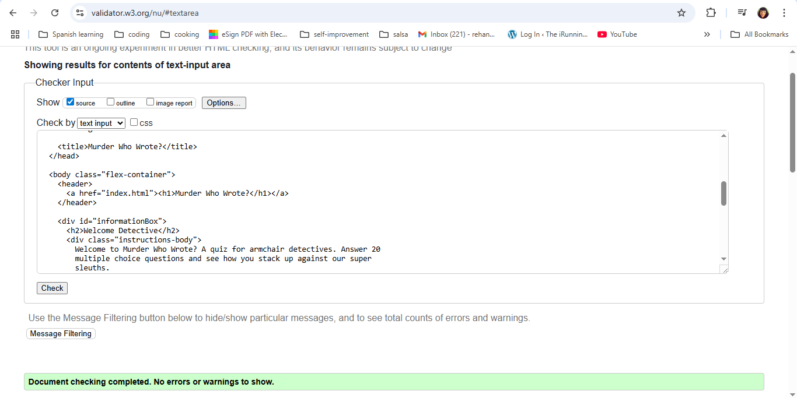
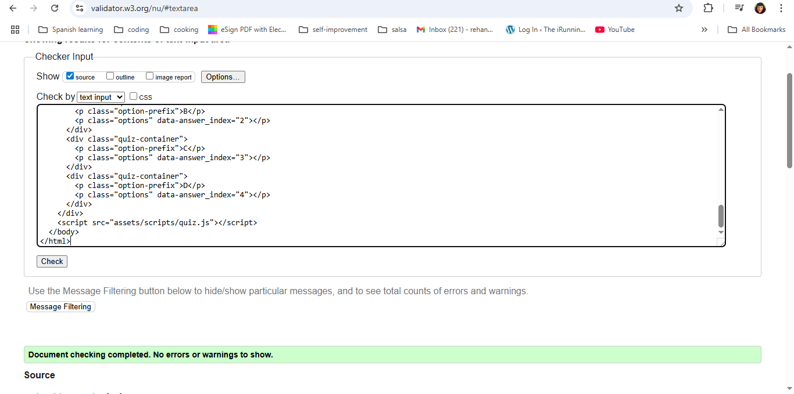
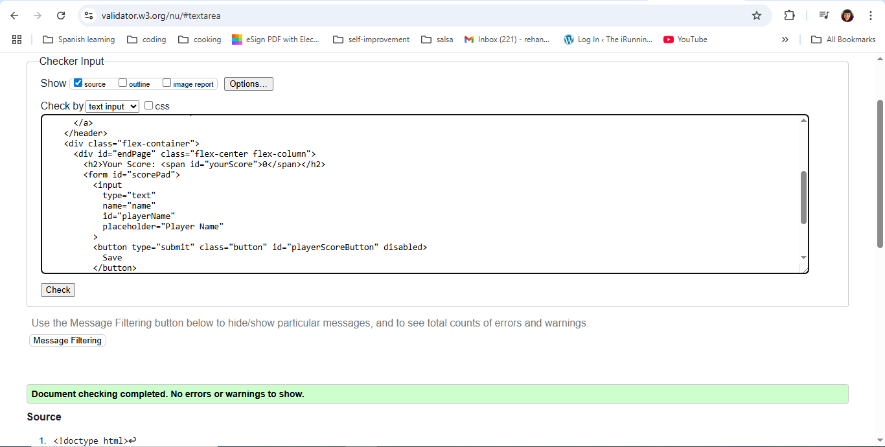
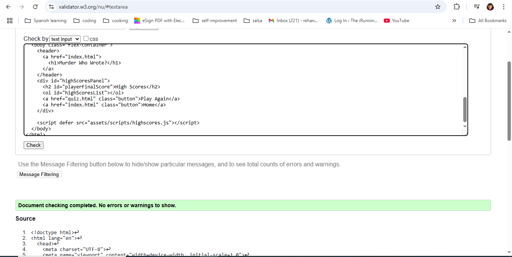
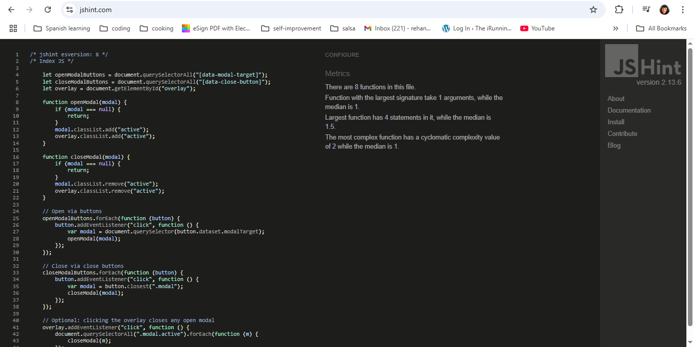
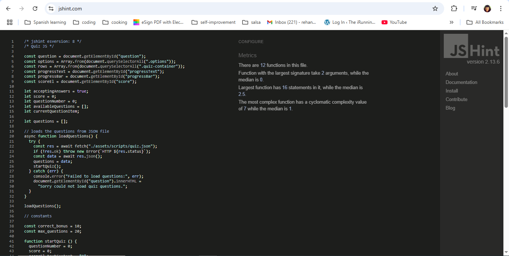
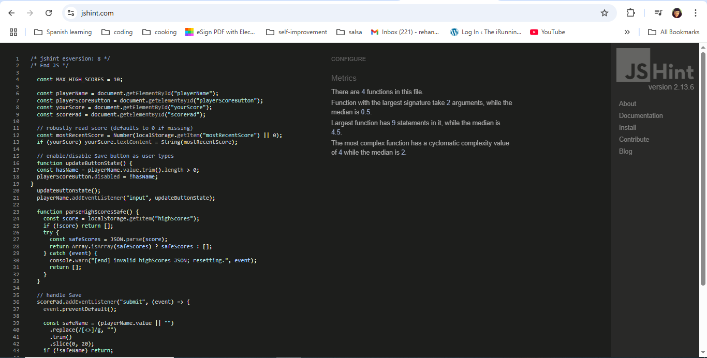

## Validation

### HTML Validation

Each HTML file was tested using the [W3C Markup Validator](https://validator.w3.org/)

Common issues such as invalid attributes (answer_index) and empty headings were corrected:

- Trailing slash on void elements that had no effect removed.

- Replaced answer_index with valid HTML5 data-answer-index.

- Added comments/placeholder text inside dynamic <h2> headings.

| File              | Screenshot                                                        | Notes                                                   |
| ----------------- | ----------------------------------------------------------------- | ------------------------------------------------------- |
| `index.html`      |            | Passed with no errors.                                  |
| `quiz.html`       |              | Updated attributes and resolved empty heading warnings. |
| `end.html`        |                | Passed validation cleanly.                              |
| `highscores.html` |  | Fully valid structure.                                  |

### CSS Validation

The CSS file was tested using the [W3C CSS Validator](https://jigsaw.w3.org/css-validator/)

The file was found to have no errors as evidenced here:

| Feature                        | Expected Result                                      | Actual Result | Pass |
| ------------------------------ | ---------------------------------------------------- | ------------- | ---- |
| Quiz loads questions from JSON | Questions displayed correctly                        | ✔️            | ✔️   |
| Selecting correct answer       | Score increases by 10 points                         | ✔️            | ✔️   |
| Selecting incorrect answer     | Correct answer highlighted                           | ✔️            | ✔️   |
| End screen saves score         | Score stored in LocalStorage                         | ✔️            | ✔️   |
| High scores page               | Displays sorted leaderboard                          | ✔️            | ✔️   |
| Empty leaderboard              | Displays “No high scores yet — play a game!” message | ✔️            | ✔️   |

### JavaScipt Validation (JSHint)

| File            | Screenshot                                                 | Notes                                                           |
| --------------- | ---------------------------------------------------------- | --------------------------------------------------------------- |
| `index.js`      |            | ES6 syntax validated successfully.                              |
| `quiz.js`       |              | Updated `data-answer-index` and resolved line break warnings.   |
| `end.js`        |                | Refactored `!` usage and improved clarity for readability.      |
| `highscores.js` |  | Fixed illegal `return` statement and confirmed score rendering. |
