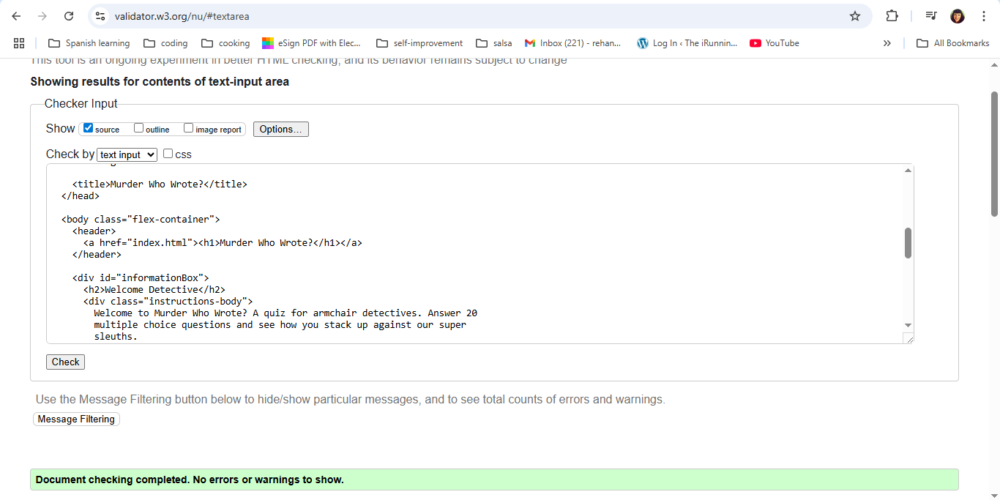
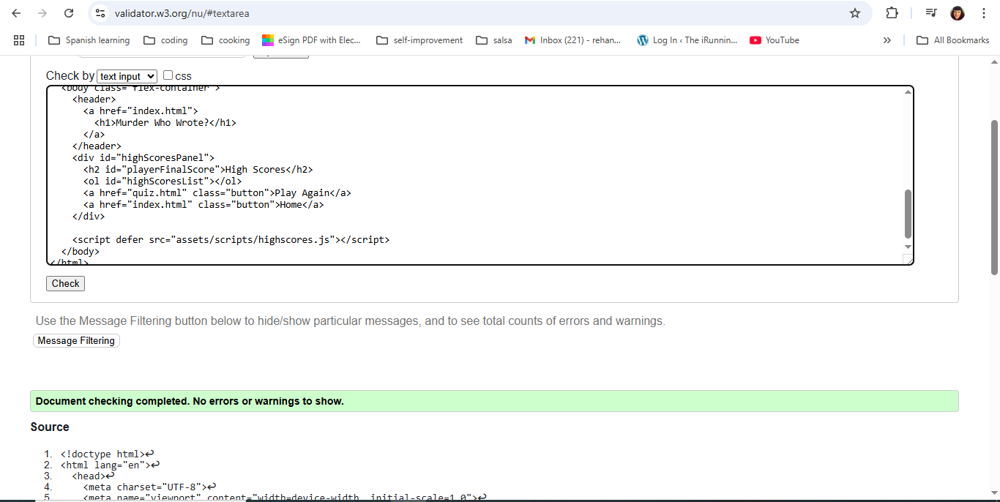
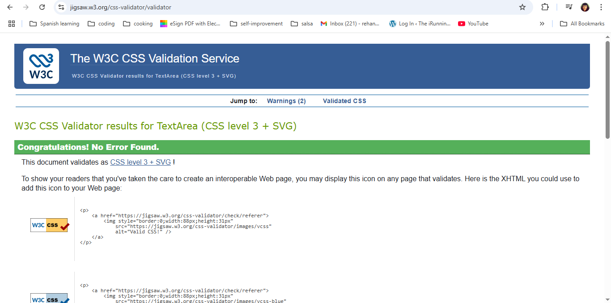
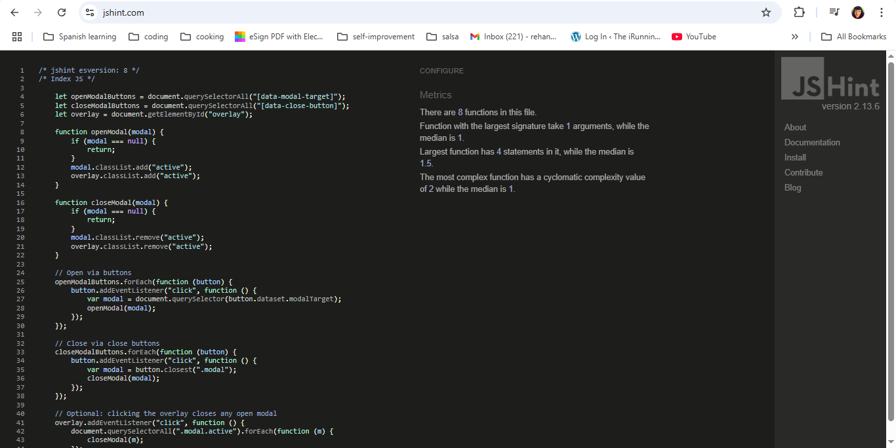
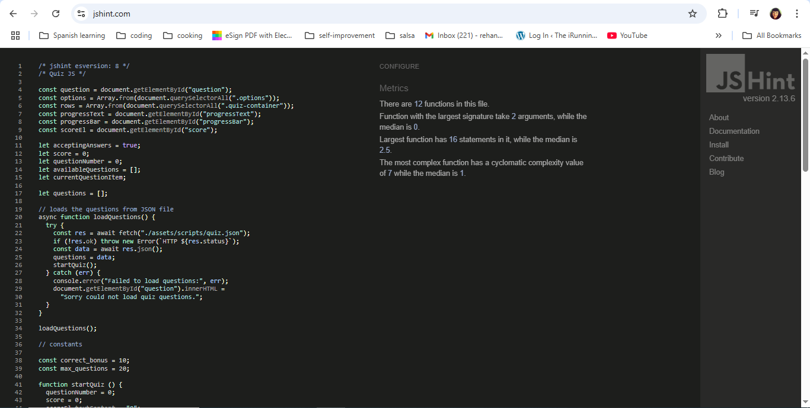
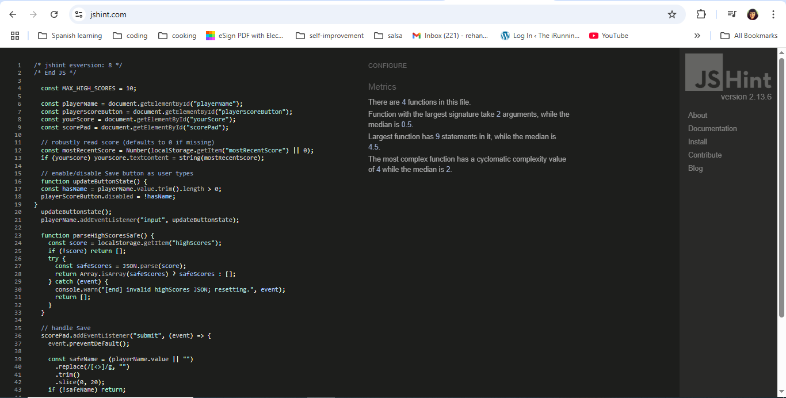
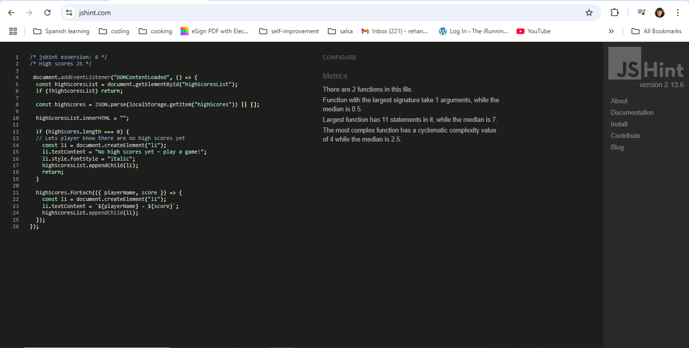

# Murder Who Wrote? - Testing 🧪

Visit the deployed site: [Murder Who Wrote?](https://rehanon-mackenzie.github.io/murder-who-wrote-quiz/index.html)

## Contents
* [Overview of Testing]
* [Automated Testing](#automated-testing)
    * [Validation Testing](#validation-testing)
        * [HTML Validation](#html-validation)
        * [CSS Validation](#css-validation)
        * [JavaScript Validation](#javascript-validation-jshint)
        * [Lighthouse Testing](#lighthouse-testing)
* [Manual Testing](#manual-testing)
    * [Testing User Stories](#testing-user-stories)
    * [Full Testing](#full-testing)
        * [Responsiveness](#responsiveness)
        * [Browser Compatibility](#browser-compatibility)
        * [Summary](#summary)

## Overview of Testing

In developing *Murder Who Wrote?* both automated and testing was employed.  Automat

The testing process was ongoing thoroughout the development of the quiz and it is true what they say the best way to learn is by doing. 

I used the console throughout to test code and error check as I went.  The tutorials from Code Institute on using Google Development Tools were really useful.  I made good use of the Sources tab and was regularly adding breakpoints to my code to find out what was actually going on.

In future I will keep a debugging diary because I think this will be a really good way of visualising my learning.

## Automated Testing

Please see below the various Automated testing that I undertook during development.

### Validation Testing

#### HTML Validation

Each HTML file was tested using the [W3C Markup Validator](https://validator.w3.org/)

Common issues such as invalid attributes (answer_index) and empty headings were corrected:

- Trailing slash on void elements that had no effect removed.

- Replaced answer_index with valid HTML5 data-answer-index.

- Added comments/placeholder text inside dynamic h2 headings.

| File              | Screenshot                                                        | Notes                                                   |
| ----------------- | ----------------------------------------------------------------- | ------------------------------------------------------- |
| `index.html`      |            | Passed with no errors.                                  |
| `quiz.html`       |              | Updated attributes and resolved empty heading warnings. |
| `end.html`        |                | Passed validation cleanly.                              |
| `highscores.html` |  | Fully valid structure.            
| `404.html` |    | Passed with no errors.                   |

#### CSS Validation

The CSS file was tested using the [W3C CSS Validator](https://jigsaw.w3.org/css-validator/)

The file was found to have no errors as evidenced here:

#### JavaScript Validation (JSHint)

| File            | Screenshot                                                 | Notes                                                           |
| --------------- | ---------------------------------------------------------- | --------------------------------------------------------------- |
| `index.js`      |            | ES6 syntax validated successfully.                              |
| `quiz.js`       |              | Updated `data-answer-index` and resolved line break warnings.   |
| `end.js`        |                | Refactored `!` usage and improved clarity for readability.      |
| `highscores.js` |  | Fixed illegal `return` statement and confirmed score rendering. |

#### Lighthouse Testing

I used the Lighthouse extension within Chrome Developer Tools to test performance, accessibility, best practices and SEO of the website.

*Home: Performance 99, Accessibility 100, Best Practices 100, SEO 100*

*Quiz: Performance 98, Accessibility 100, Best Practices 100, SEO 90*

*End: Performance 97, Accessibility 100, Best Practices 100, SEO 90*

*High Scores: Performance 100, Accessibility 100, Best Practices 100, SEO 90*

## Manual Testing

### Testing User Stories

`First Time Visitors`

| Goals | How are they achieved? |
| :--- | :--- |
| I want to test my knowledge on the TV detectives show I love. | Murder Who Wrote? Delivers a randomised selection of questions for users about shows such as Columbo, Poirot and Midsomer Murders |
| I want the site to be responsive to the device I'm using. | I have developed the site with responsiveness in mind. |
| I want the site to be easy to navigate. | On every page the user can navigate to return to the home page by clicking on the header logo.  |
| I want clear instructions on how I play the quiz so I have the best chance of getting a good score. | Clicking on the instructions button on the homepage brings up a modal that explains exactly how to play the quiz.

`Returning Visitors`

|  Goals | How are they achieved? |
| :--- | :--- |
|I want to be able to see the answers to the questions I answered incorrectly. | If a user chooses an incorrect answer the correct answer will be displayed by a dynamic changing background colour also. Before the quiz transitions to the next question. |

`Frequent Visitors`

| Goals | How are they achieved? |
| :--- | :--- |
| I want to be able to store my score so I can see how I am improving and how I rank against other players. | Users of the site are able to log their high scores to the high scores page. The top ten results will be displayed. |

### Full Testing

#### Responsiveness

Tested on physical devices and Chrome DevTools presets.

| Device / Viewport | Expected Result | Actual Result | Pass |
|--------------------|----------------|----------------|:---:|
| iPhone SE (375x667) | Content readable, buttons accessible | Works as expected | ✅ |
| iPad (768x1024) | Layout centered, modal fits screen | Works as expected | ✅ |
| Laptop (1366x768) | Layout stable, hover colours visible | Works as expected | ✅ |
| Desktop (1920x1080) | Layout scales correctly, all elements visible | Works as expected | ✅ |

#### Browser Compatibility

| Browser | Version | Result |
|----------|----------|--------|
| Chrome | 129 | Pass |
| Firefox | 130 | Pass |
| Edge | 128 | Pass |
| Safari (iOS 17) | Mobile | Pass |

#### Home Page Testing

| Feature  | Expected outcome  | Testing performed  | Result  | Pass/Fail  |
| ------------ | ------------ | ------------ | ------------ | ------------ |
| The h1 title encloses a link anchor  | To take the user to index html page  | Click link | Took user to index.html | Pass  |
| Hover colour change on h1 to identify link | The h1 will change to the secondary colour to identify it's a clickable link | Hover over h1 | h1 changed to secondary colour | Pass|
|  Instructions button / modal | Modal to pop up with instructions on top of overlay | Click instructions button  | modal pops up  | Pass  |
|  Close modal | Modal to close when clicked on close x | Click close x | Modal closed and overlay removed  | Pass  |
| Play button | To take the user to quiz html | Click button | Took user to quiz.html | Pass |
| High Scores button | To take the user to  highscores html page | Click button  | Took user to highscores.html | Pass  |

#### Quiz Page Testing 

| Feature  | Expected outcome  | Testing performed  | Result  | Pass/Fail  |
| ------------ | ------------ | ------------ | ------------ | ------------ |
| The h1 title encloses a link anchor  | To take the user to index html page  | Click link | Took user to index.html | Pass  |
| Hover colour change on h1 to identify link | The h1 will change to the secondary colour to identify it's a clickable link | Hover over h1 | h1 changed to secondary colour | Pass|
| Questions load automatically from JSON | Click an answer option and then the next question appears | Click an answer option | Next question loaded | Pass
| Correct answer | Click on your chosen answer and the background colour turns green temporarily to indicate it's correct | Click correct answer | Answer choice background colour turned green | Pass |
| Incorrect answer | Click your chosen answer and it background colour turns red temporarily and the correct answer background colour turns green temporarily | Click incorrect answer | Answer choice background colour turned red and correct answer background colour turned green | Pass|
| Progress bar | When you answer a question the progress bar text advances by one and the progress bar itself proportionally fills in its background colour green | Click an answer option | The question text advanced by one and the progress bar background colour filled in proportionally | Pass | 
| Score correct answer | Click on correct answer and score total increases by 10 points | Click on correct answer | Score total increased by 10 points | Pass |
| Score wrong answer | Click on  wrong answer and score total stays the same | Click incorrect answer | Score total stayed the same | Pass |
Quiz ends | When 20 questions have been answered user is taken to end page html and their score is displayed | Answer 20 questions | Answered 20 questions and was took to end.html and the total score was displayed| Pass |
| Home button | o take the user to index html page  | Click button  | Took user to index.html | Pass  |

#### End Page Testing

| Feature  | Expected outcome  | Testing performed  | Result  | Pass/Fail  |
| ------------ | ------------ | ------------ | ------------ | ------------ |
| The h1 title encloses a link anchor  | To take the user to index html page  | Click link  | Took user to index.html | Pass  |
| Hover colour change on h1 to identify link | The h1 will change to the secondary colour to identify it's a clickable link | Hover over h1 | h1 changed to secondary colour | Pass|
| Player name input | User can type in the input field and save their name with their score | Type in input field and | Was able to enter name in input field | Pass |
| Save button | The player name and their score will save to local | Click button | Player name and score saved to local storage | Pass|
| Save button disabled | If no text is entered in player name field the save button is disabled | Click button | Tried to click button but it was disabled | Pass |
| Play again button | To take the user to quiz html | Click button | Took user to quiz.html | Pass |
| Home button | To take the user to index html page  | Click button  | Took user to index.html | Pass  |

#### High Scores Page Testing

| Feature  | Expected outcome  | Testing performed  | Result  | Pass/Fail  |
| ------------ | ------------ | ------------ | ------------ | ------------ |
| The h1 title encloses a link anchor  | To take the user to index html page  | Click link  | Took user to index.html | Pass  |
| Hover colour change on h1 to identify link | The h1 will change to the secondary colour to identify it's a clickable link | Hover over h1 | h1 changed to secondary colour | Pass |
| High scores list | Players and their high scores are pulled from local storage and render in a top  ten list | Save a score and player name on end page html | Player name and score rendered in a numbered list on high scores page | Pass |
| Home button | To take the user to index html page  | Click button  | Took user to index.html | Pass  |
| Clear high scores button | Delete high scores from local storage, clear high list and display "No high scores yet - play a game!" | Click button | Deleted local high scores from local storage, cleared high scores list and displayed "No high scores yet - play a game!" | Pass |

#### Summary

All tests passed successfully. The site performs consistently across devices and browsers, with no functional bugs remaining.

| Feature                        | Expected Result                                      | Actual Result | Pass |
| ------------------------------ | ---------------------------------------------------- | ------------- | ---- |
| Quiz loads questions from JSON | Questions displayed correctly                        | ✔️            | ✔️   |
| Selecting correct answer       | Score increases by 10 points                         | ✔️            | ✔️   |
| Selecting incorrect answer     | Correct answer highlighted                           | ✔️            | ✔️   |
| End screen saves score         | Score stored in LocalStorage                         | ✔️            | ✔️   |
| High scores page               | Displays sorted leaderboard                          | ✔️            | ✔️   |
| Empty leaderboard              | Displays “No high scores yet — play a game!” message | ✔️            | ✔️   |

### 💭 Reflection

At the start I honestly thought JavaScript was going to break my brain.  However, I have learned so much during this process and it has reminded me I can do hard things and I am excited to take this learning into the next module.  